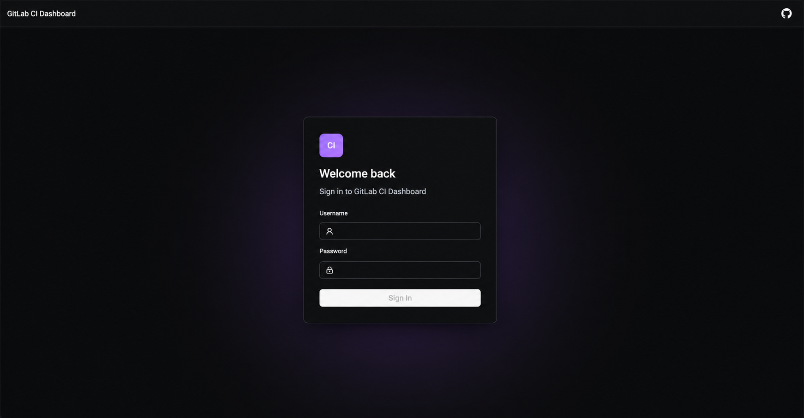
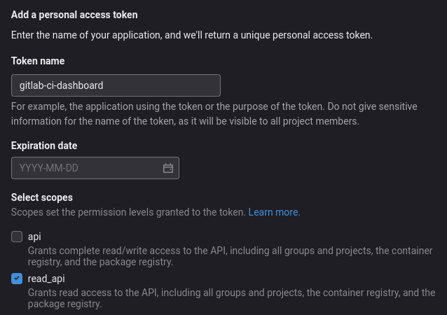

# Gitlab CI Dashboard

[](https://hub.docker.com/r/larscom/gitlab-ci-dashboard)
[](https://github.com/larscom/gitlab-ci-dashboard/actions/workflows/workflow.yml)
[](https://opensource.org/licenses/MIT)

## Preview

### Pipeline dashboard


### Pipeline table


### Optional login



<br />

Gitlab CI Dashboard will provide you with a **global** overview of pipelines, runners, and their statuses within a
single group.
The default functionality of Gitlab is limited at the project level. This can become hard to manage when you have a lot
of
projects, potentially resulting in undetected failed pipelines.

## 👉 [Demo](https://gitlab-ci-dashboard.larscom.nl)

<br />

## 🚀 Highlights

- View all pipeline statuses per group (e.g: failed/canceled/success)
- View group runners, availability, execution state, and currently running jobs
- You won't get rate limited by the Gitlab API, due to server-side caching
- Communication to the Gitlab API happens only server side
- Only 1 `read only` token is needed to serve a whole team
  - Optionally use a `read/write` token to perform actions like restarting failed pipelines, create new pipelines or
    cancel pipelines.

## ✅ Features

- [x] Overview of all latest pipeline statuses within a group
- [x] Overview of all pipeline statuses within a group
- [x] Read-only overview of group runners and their active jobs
- [x] Navigate to Gitlab
- [x] Shows jobs and their status per pipeline
- [x] Download artifacts from jobs directly
- [x] Search for projects within a group
- [x] Filter pipelines by status
- [x] Filter pipelines by projects and topic
- [x] Filter pipelines by failed jobs
- [x] Add projects to favorites
- [x] Start a new pipeline (requires read/write API token)
- [x] Restart failed pipelines (requires read/write API token)
- [x] Cancel pipelines (requires read/write API token)

## 📒 Features (PLANNED)

- [ ] Overview of all registries (container/package) within a group
- [ ] ... suggestions are welcome

## ⚡️ Requirements

- Gitlab server (v4 API)
- API token (read only or read/write)
- To use the Runners page, the token must include runner read access (`manage_runner` on GitLab versions that require
  it), and its user must have an Owner, Auditor, or suitable custom runner-management role in the group. Active job
  details are shown only for projects the token user can access.
- Docker

## 💡 Getting started

1. Generate a `read_api` or `api` access token in Gitlab, depending on your requirements (
   e.g: https://gitlab.com/-/profile/personal_access_tokens)

   The read-only Runners page requires the `manage_runner` token scope and suitable group access (Owner, Auditor, or a
   custom role with `admin_runners`). Active jobs are shown only for projects the token user can access.



2. Run docker with a TOML configuration file. The application reads runtime configuration from `api/config.toml`.

```bash
docker run \
  -p 8080:8080 \
  -v ./api/config.toml:/app/config.toml \
  larscom/gitlab-ci-dashboard:latest
```

> The current runtime configuration is loaded from `api/config.toml`. `GLCIDBR__*` environment variables are no longer supported.

3. Dashboard should be available at: http://localhost:8080/ showing (by default) all available groups and their
   projects.

4. Sign in using the credentials from `api/config.toml` and add GitLab environments/tokens from the web UI.

### Runner monitoring permissions

The read-only Runners page uses GitLab's group runners and runner jobs endpoints. The token user must be an Owner or
Auditor of the group, or have a custom role with `admin_runners`. The token must also be allowed to read runner
information (GitLab documents the `manage_runner` scope for these endpoints). Active job details are limited to projects
the token user can access.

## 👉 Create/Cancel/Retry Pipelines

You are able to perform write operations like creating, canceling, and retrying pipelines. Configure this in `api/config.toml` by setting `ui.read_only = false`.

GitLab environments and tokens are managed from the dashboard UI after startup.

## 👉 Hide the 'write' operations button

To hide the ellipsis action button (...) when using the app in read-only mode, set `ui.hide_write_actions = true` in `api/config.toml`.

## ⏰ Prometheus

Prometheus metrics are exposed on the following endpoint

> http://localhost:8080/metrics/prometheus

## Analytics persistence

Docker Compose starts PostgreSQL and enables analytics persistence automatically. The backend applies embedded
database migrations on startup, synchronizes pipeline history in the background, and retains 90 days by default.
Existing dashboard requests also update the analytics store. The current UI remains unchanged while the stored data
provides the foundation for analytics panels.

Set `database.url` in `api/config.toml` before production deployment. Non-Compose deployments remain compatible because analytics is disabled unless `analytics.enabled = true` and `database.url` is provided.


## 🔌 Configuration

The application reads runtime configuration from `api/config.toml`.
`api/config.example.toml` is a template that shows the supported configuration structure. Copy it to `api/config.toml`, then update the values for your deployment.

### Supported config variables

| Key | Type | Description | Required | Default |
| --- | --- | --- | --- | --- |
| `server.listen_ip` | string | Network interface address for the web server | no | `0.0.0.0` |
| `server.listen_port` | int | Port for the web server | no | `8080` |
| `server.worker_count` | int | Number of worker threads | no | `4` |
| `security.environment_token_encryption_key` | string | 64 hex chars used to encrypt GitLab tokens stored in the database | yes | |
| `authentication.username` | string | Admin username for dashboard login | yes | |
| `authentication.password` | string | Admin password for dashboard login | yes | |
| `authentication.secure_cookie` | bool | Use secure cookies when TLS is enabled | no | `false` |
| `database.url` | string | PostgreSQL connection URL for analytics persistence | yes if analytics enabled | |
| `database.max_connections` | int | Maximum database pool connections | no | `10` |
| `analytics.enabled` | bool | Enable PostgreSQL-backed analytics persistence | no | `true` |
| `analytics.sync_interval_seconds` | int | Background sync interval for analytics | no | `300` |
| `analytics.retention_days` | int | Days of analytics history to keep | no | `30` |
| `cache.group_ttl_seconds` | int | Group cache TTL | no | `300` |
| `cache.project_ttl_seconds` | int | Project cache TTL | no | `300` |
| `cache.branch_ttl_seconds` | int | Branch cache TTL | no | `60` |
| `cache.job_ttl_seconds` | int | Job cache TTL | no | `60` |
| `cache.pipeline_ttl_seconds` | int | Pipeline cache TTL | no | `300` |
| `cache.schedule_ttl_seconds` | int | Schedule cache TTL | no | `300` |
| `cache.runner_ttl_seconds` | int | Runner list cache TTL | no | `60` |
| `cache.runner_detail_ttl_seconds` | int | Runner detail cache TTL | no | `300` |
| `cache.runner_job_ttl_seconds` | int | Runner job cache TTL | no | `15` |
| `cache.artifact_ttl_seconds` | int | Artifact cache TTL | no | `1800` |
| `pipeline.history_days` | int | Number of days to fetch pipeline history | no | `30` |
| `ui.read_only` | bool | Disable write operations in the dashboard | no | `true` |
| `ui.hide_write_actions` | bool | Hide the write action button when in read-only mode | no | `false` |
| `ui.page_size_options` | array | Available page sizes in table pagination | no | `[10, 20, 30, 40, 50]` |
| `ui.default_page_size` | int | Default selected page size | no | `10` |

### Load from TOML file

Mount the runtime config inside the container (`/app/config.toml`):

```bash
docker run \
  -p 8080:8080 \
  -v ./api/config.toml:/app/config.toml \
  larscom/gitlab-ci-dashboard:latest
```

## 📜 Custom CA certificate

If you are running a gitlab instance that is using a TLS certificate signed with a private CA you are able to provide that CA as mount (PEM encoded)

This is needed when the dashboard backend is unable to make a connection to the gitlab API over HTTPS.

Mount the `ca.crt` inside the container (`/app/certs/ca.crt`)

```bash
docker run \
  -p 8080:8080 \
  -v ./api/config.toml:/app/config.toml \
  -v ./ca.crt:/app/certs/ca.crt \
  larscom/gitlab-ci-dashboard:latest
```

### Troubleshooting

If you are still unable to connect with a custom CA cert, be sure that the gitlab server certificate contains a valid SAN (Subject Alternative Name)

If there is a mismatch the HTTP client is still unable to make a proper connection.

## 🔀 Reverse proxy

Below is a working config for a `Caddy` reverse proxy server to serve the dashboard on a different path.

```bash
:80 {
    handle_path /my-custom-path* {
        reverse_proxy gitlab-ci-dashboard:8080
    }
}
```

The dashboard should now be available at: https://example.com/my-custom-path

## 🌍 Runtime configuration

The application reads runtime configuration from `api/config.toml`. The current code does not support `GLCIDBR__*` runtime environment variables.

See `api/config.example.toml` for the actual supported config format.

### Additional environment support

- `RUST_LOG`: optional. Use this to set the log level for the application, e.g. `RUST_LOG=debug`.
